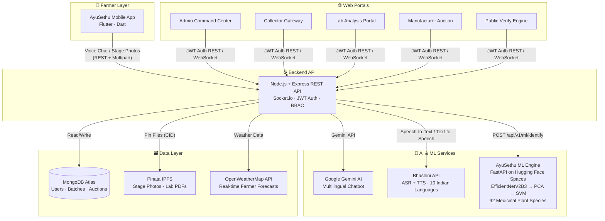

# 🌿 AyuSethu — AI-Powered Medicinal Plant Supply Chain

> *From the farmer's field to the pharmacist's shelf — verified, transparent, and traceable at every step.*

AyuSethu is a full-stack, AI-driven agricultural supply chain platform purpose-built for **medicinal plant traceability** in India. It bridges rural farmers, collectors, certified laboratories, and pharmaceutical manufacturers through a unified ecosystem that uses voice-AI, computer vision, decentralized storage, and blockchain-inspired audit trails to guarantee authenticity and quality at every supply chain stage.

---

## 📐 System Architecture



---

## 🧩 Monorepo Structure

```
Ayusethu/
├── backend/          # Node.js REST API + WebSocket Server
├── frontend/         # React + Vite Web Portals (5 role-based dashboards)
├── mobile/           # Flutter Farmer Mobile App (Voice-First AI)
└── ml-model/         # FastAPI ML Inference Service (Hugging Face Spaces)
```

---

## 🌟 Key Features

### 🎙️ Voice-First Farmer Onboarding (Mobile)
- Rural farmers interact exclusively via native language voice — no literacy required.
- **Gemini AI** conducts a contextual, multi-turn onboarding conversation.
- **Bhashini** handles ASR (speech → text) and TTS (text → speech) in 10+ Indian languages including Telugu, Hindi, Tamil, Kannada.
- Captured data automatically creates the first crop batch in the system.

### 🌿 5-Stage Crop Timeline
- Every crop follows a **240-day, 5-stage** phenotypic growth timeline.
- At each stage, the farmer must upload a **GPS-tagged + camera photo** via the mobile app.
- Photos are pinned directly to **Pinata IPFS** for immutable verification before they are evaluated.

### 🤖 ML-Powered Species Identification
- The Collector triggers an ML scan on any batch.
- The API calls the **AyuSethu ML Engine** (FastAPI, deployed on Hugging Face Spaces with 16GB RAM).
- The engine runs the image through: `EfficientNetV2B3 (feature extraction) → PCA (1024 components) → SVM (92 species classes)`.
- Returns top-3 predictions with confidence scores.

### 🔬 Lab Pharmacognostic Certification
- Lab technicians enter chemical assay data for a verified batch.
- The platform auto-generates a **tamper-proof PDF certificate** and pins it to IPFS.
- The resulting IPFS CID is permanently attached to the batch record.

### 🏛️ Manufacturer Auction Engine
- Verified, certified batches enter a **real-time WebSocket auction** (`Socket.io`).
- Pharmaceutical manufacturers place live bids.
- The winning manufacturer receives a QR code tied to the full provenance trail.

### 🔍 Public Transparency Engine
- Any consumer can scan the QR code and visit `/verify/:batchId`.
- The page reveals the **complete audit trail**: farmer details, GPS coordinates, growth stage photos (via IPFS), ML confidence scores, lab PDF certificate, and final auction winner.

---

## 🛠️ Tech Stack

| Layer | Technology |
|---|---|
| **Mobile** | Flutter, Dart, `geolocator`, `image_picker`, `audioplayers` |
| **Web Frontend** | React, Vite, Tailwind CSS, Framer Motion, Socket.io-client |
| **Backend API** | Node.js, Express, Socket.io, JWT, Mongoose |
| **ML Engine** | FastAPI, TensorFlow 2.18, Scikit-learn, Pillow, Uvicorn |
| **AI Chatbot** | Google Gemini API (gemini-pro) |
| **Voice Engine** | Bhashini API (ULCA) |
| **Database** | MongoDB Atlas |
| **Decentralized Storage** | Pinata IPFS (Filecoin) |
| **ML Hosting** | Hugging Face Spaces (Docker, 16GB RAM free tier) |
| **Backend Hosting** | Render (Node.js web service) |
| **Weather** | OpenWeatherMap API |

---

## 🚀 Getting Started

### Prerequisites
- Node.js 20+, npm
- Flutter SDK 3.x
- Python 3.11+
- MongoDB Atlas account
- Pinata account (for IPFS)
- Google Gemini API key
- Bhashini/ULCA API credentials

### 1. Backend
```bash
cd backend
npm install
cp .env.example .env   # Fill in your secrets
npm run dev
```

### 2. Frontend
```bash
cd frontend
npm install
# Set VITE_API_BASE_URL in .env
npm run dev
```

### 3. Mobile App
```bash
cd mobile
flutter pub get
# Update lib/config/api_constants.dart with your backend URL
flutter run
```

### 4. ML Engine
```bash
cd ml-model
python -m venv venv && source venv/bin/activate
pip install -r requirements.txt
uvicorn main:app --host 0.0.0.0 --port 8000
```

---

## 🌐 Live Deployments

| Service | URL |
|---|---|
| Backend API | https://ayusethuapi.onrender.com |
| ML Inference Engine | https://nsrc-ayusethuml.hf.space |
| Web Portals | *(Render static deploy)* |

---

## 🔐 Environment Variables

All sensitive keys live in `.env` files at the service level. See `backend/.env.example` for the required fields. **Never commit `.env` files.**

---

## 📄 License

ISC — Built for the AyuSethu Agricultural Supply Chain Initiative.
